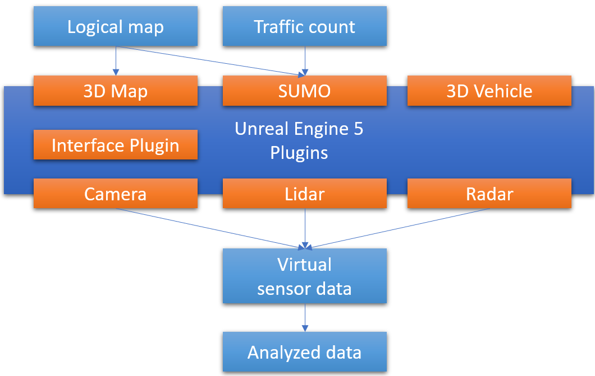

# GEMSTAR 

**Planned publication: Q4/2025**

GEMSTAR is the GEoMetry based Sensor simulation Toolchain for Automotive and Rail research.\
The simulation tool will aid the descision process for approval of operation domain (OD) and Operational Design Domain (ODD) for automated vehicles.
It is based on [Unreal Engine 5](https://www.unrealengine.com/en-US/unreal-engine-5).

The inputs to the tool are a logical map ([OpenDRIVE](https://www.asam.net/standards/detail/opendrive/)) and scenarios based on traffic data ([OpenSCENARIO](https://www.asam.net/standards/detail/openscenario/v200/), [SUMO](https://eclipse.dev/sumo/) scenarios).
Corresponding 3D maps can be easily changed via the Plugin system.\
Sensor models are integrated via [FMI](https://fmi-standard.org/) and [OSI](https://www.asam.net/standards/detail/osi/) Messages, like the [ENVITED Open Source Model & Simulation Library](https://github.com/openMSL).
The collected data is analysed afterwards.

Check out our previous toolchain [OSTAR](https://github.com/DLR-TS/OSTAR-Quickstart/) using the Carla simulator.
