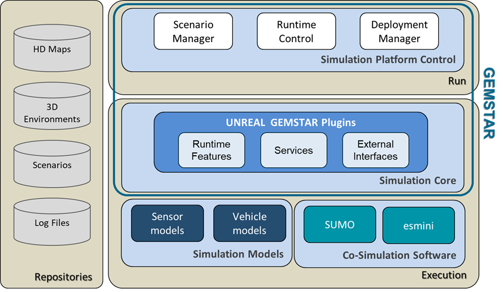
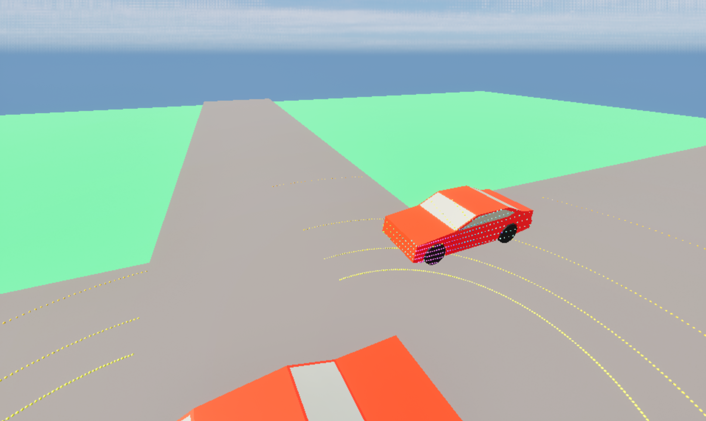

# GEMSTAR (GEoMetry based Sensor simulation Toolchain for Automotive and Rail research)

[](https://www.dlr.de/en/ts/about-us/the-institute-of-transportation-systems)

GEMSTAR is the GEoMetry based Sensor simulation Toolchain for Automotive and Rail research.\
The simulation tool supports the descision process for approval of operation domain (OD) and Operational Design Domain (ODD) for automated vehicles.

The simulation software GEMSTAR is a set of [Unreal Engine 5.3](https://www.unrealengine.com/en-US/unreal-engine-5) Plugins.
Each plugin can be used standalone in Unreal to maximise flexibility.
GEMSTAR combines exisiting simulation tools in a co-simulation and uses [OSI](https://www.asam.net/standards/detail/osi/) standardized messages for logging and communication.
It is designed to be tailored to your project specific needs by integration of [SUMO](https://eclipse.dev/sumo/), [esmini](https://esmini.github.io/) and more by using the [Game Feature Plugin](https://dev.epicgames.com/documentation/en-us/unreal-engine/game-features-and-modular-gameplay-in-unreal-engine) system.
Future updates will add new features: OSI Playback, OpenDrive map import, Traffic Lights, Radar, Interfaces to [ROS2](https://ros.org/) and [OSMP](https://www.asam.net/standards/detail/osi/).



# Use Cases

- Evaluating vehicle and route compatibility.
- Selecting the optimal infrastructure for automated vehicles.
- Testing planned sensor configurations.



# Getting started

## Requirements
- Windows 11
- Unreal Engine 5.3
- Visual Studio 2022
- Git

## Setup
```sh
git clone https://github.com/DLR-TS/gemstar.git
cd gemstar
git submodule update --init
```

Run PostGitPull_ReGenVSFiles.bat\
Open GEMSTAR.sln\
Build GEMSTAR\
Run in "DebugGame Editor" configuration

# Map integration
A combined example map is located in the Content directory. It shows the integration of the different plugins. GEMSTAR is configured by using Config/DefaultGemstar.ini file. The OSI logs are saved in the Output directory.

To make a new map runnable with GEMSTAR only GEMSTARRoot is needed to load and set configurations for all activated GEMSTAR plugins. 3D assets can be added if needed.

## Feature test maps

Within each game feature plugin are maps that show the functionality of the respective feature. They are configured through Level Blueprints and configuration ini files.

---------------
**Contact:** opensource-ts@dlr.de

# License

This project is published under the Eclipse Public License 2.0.

This project uses the Open Simulation Interface ([OSI](https://github.com/OpenSimulationInterface/open-simulation-interface)), which is licensed under the Mozilla Public License 2.0.\
This project uses [esmini](https://github.com/esmini/esmini), which is licensed under the Mozilla Public License 2.0.\
This project uses [Eclipse SUMO](https://github.com/eclipse-sumo/sumo), which is licensed under the Eclipse Public License 2.0.
